# 신인철 | 백엔드 · GIS/AI 플랫폼 개발자

운동선수에서 개발자로 전향한 후 11년간 지자체 GIS·스마트시티 플랫폼을 설계하고 개발해 왔습니다.
최근에는 VLM/LLM을 실제 재난 관제 업무에 접목하는 일을 하고 있습니다.

📧 incheols2929@gmail.com · 🔗 [github.com/incheols2929](https://github.com/incheols2929)

---

## 핵심 역량

- **지자체 GIS·스마트시티 도메인 11년** — 완도·영광·해남·곡성·영암·정읍·남원·무안군 및 전남도청의 공간정보, CCTV 통합관제, 재난관제 시스템을 연속해서 수행해 왔습니다.
- **요구정의부터 운영까지 단독 풀스택** — 모든 프로젝트에서 개발PM과 설계(기능정의·화면설계·DB설계)를 겸하며 프론트엔드와 백엔드를 직접 구현했습니다.
- **AI를 업무 시스템에 접목** — 로컬 LLM 기반 행정 RAG와 VLM 기반 재난 영상판정을, GPU 추론 서버 구축부터 LoRA 파인튜닝 환류 체계까지 직접 설계하고 구현했습니다.
- **적극적인 소통과 기술 도입** — 문제 해결을 위해 적극적으로 소통하며, 새로운 기술 도입에도 주저하지 않습니다.

---

## 기술 스택

| 구분 | 기술 |
|---|---|
| **언어** | Java, Python, JavaScript |
| **백엔드** | Spring MVC, Spring Boot, Spring Security, MyBatis, 전자정부프레임워크, FastAPI, JSP |
| **데이터베이스** | PostgreSQL, PostGIS, HBase |
| **GIS · 3D** | OpenLayers, OL-Cesium, Cesium.js, GeoServer, GeoTools, Three.js |
| **AI · LLM** | Qwen3-VL, Gemma-3, EEVE-Korean, PyTorch, Transformers, PEFT(LoRA), bitsandbytes, LangChain, llama-cpp-python, FAISS, HuggingFace |
| **영상 · 스트리밍** | FFmpeg, MPEG-TS, RTSP, WebSocket, SSE |
| **빅데이터** | Hadoop, Zookeeper, HBase |
| **프론트엔드** | jQuery, D3.js, Chart.js, HTML, CSS, Jinja2 |
| **기타** | Git, Linux, PowerMockup |

---

## 회사 경력

**[(주)대호이엔지](http://daehoeng.com/)** · 2015.07 ~ 현재
GIS/스마트시티 분야의 SI 개발과 개발PM을 담당하고 있습니다.

### 프로젝트 한눈에 보기

| 개발 기간 | 프로젝트 | 도메인 |
|---|---|---|
| 2026.04 ~ 2026.07 | [AI 재난관제 플랫폼 (AEGIS AI)](#ai-재난관제-플랫폼-aegis-ai) | AI · 재난관제 |
| 2026.04 ~ 2026.07 | [VLM 기반 재난 영상분석 플랫폼 (DH-Aegis)](#vlm-기반-재난-영상분석-플랫폼-dh-aegis) | AI · 영상분석 |
| 2026.03 ~ 2026.04 | [CCTV 영상 관제 웹 시스템 (DH-Watchive)](#cctv-영상-관제-웹-시스템-dh-watchive) | 영상관제 |
| 2026.03 ~ 2026.04 | [무안군 CCTV 통합관제 WebGIS 시스템 (DH-WebGIS)](#무안군-cctv-통합관제-webgis-시스템-dh-webgis) | GIS · 관제 |
| 2026.02 ~ 2026.03 | [사내 IT 인프라 자산 관리 시스템 (DH-InfraVault)](#사내-it-인프라-자산-관리-시스템-dh-infravault) | 자산관리 |
| 2026.01 ~ 2026.03 | [CCTV 자동 진단 및 모니터링 플랫폼 (DH-Watchive-Check)](#cctv-자동-진단-및-모니터링-플랫폼-dh-watchive-check) | NOC · 모니터링 |
| 2025.12 ~ 2026.02 | [AI 행정지원플랫폼 챗봇 (DH-AI)](#ai-행정지원플랫폼-챗봇-dh-ai) | LLM · RAG |
| 2025.06 ~ 2025.11 | [해남군 스마트 군정 시스템 V2 (HN-SmartOffice_V2)](#해남군-스마트-군정-시스템-v2-hn-smartoffice_v2) | 빅데이터 · GIS |
| 2024.05 ~ 2024.12 | [남원시 스마트시티 통합플랫폼 웹시스템 구축](#남원시-스마트시티-통합플랫폼-웹시스템-구축) | 스마트시티 |
| 2024.01 ~ 2024.04 | [디지털 트윈 웹 시스템 구축(3D지도 기반) v2.0](#디지털-트윈-웹-시스템-구축3d지도-기반-v20) | 3D · 디지털트윈 |
| 2023.05 ~ 2023.12 | [스마트 군정시스템 구축(빅데이터)](#스마트-군정시스템-구축빅데이터) | 빅데이터 |
| 2023.05 ~ 2023.12 | [데이터 허브](#데이터-허브) | 데이터 수집 |
| 2022.01 ~ 2023.09 | [디지털 트윈 웹 시스템 구축(3D지도 기반)](#디지털-트윈-웹-시스템-구축3d지도-기반) | 3D · 디지털트윈 |
| 2015.08 ~ 2022.01 | [이전 프로젝트 10건](#이전-프로젝트-2015--2022) | GIS · 공간정보 |

---

## 진행 프로젝트 (2022 ~ 2026)

### AI 재난관제 플랫폼 (AEGIS AI)

- **개발 기간** : 2026.04 ~ 2026.07
- **사용 기술** : `Spring MVC` `Spring Security` `MyBatis` `JavaScript` `jQuery` `JSP` `PostgreSQL` `PostGIS` `OpenLayers` `GeoServer` `GeoTools` `Qwen3-VL` `VLM`
- **시스템 설명** : CCTV 통합관제센터의 WebGIS 관제 시스템에 VLM(Vision-Language Model) 기반 AI 재난관측을 결합한 플랫폼입니다.
    - **자동 판정 파이프라인** — CCTV 스냅샷과 홍수통제소(HRFCO) 실측 수위 데이터를 AI 분석 서버로 전달하여 재난 상황을 자동 판정하고, 판정 결과를 지도·대시보드·SOP(표준행동절차) 조치로 연결합니다.
    - **관제 코파일럿** — 자연어 질문을 반경 내 다중 CCTV 동시 VLM 질의로 확산시킵니다.
    - **수위 특화 AI** — 실측 수위를 프롬프트에 주입하여 판단을 접지시킵니다.
    - **판정 신뢰도 확보** — 판정 교차검증·트리아지와 타임랩스 전후 비교를 제공합니다.
    - **AI 브리핑 보고서** — `핵심 / 상황 / 조치` 3층 서술을 자동 생성하며, 엑셀·HWPX로 다운로드할 수 있습니다.
    - **학습 환류** — 관제요원의 정탐/오탐 판정이 학습 데이터셋으로 자동 환류되어 AI 정확도를 지속적으로 개선합니다.
- **담당 역할** : 개발PM, 설계(기능정의, 화면설계, DB설계, AI 아키텍처 설계), 프론트엔드+백엔드 개발

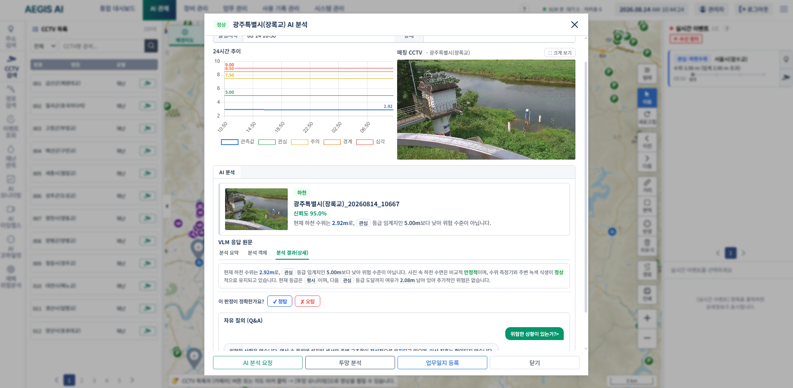

 

### VLM 기반 재난 영상분석 플랫폼 (DH-Aegis)

- **개발 기간** : 2026.04 ~ 2026.07
- **사용 기술** : `Python` `FastAPI` `PyTorch` `Transformers` `PEFT(LoRA)` `bitsandbytes` `Qwen3-VL` `Gemma-3` `Spring MVC` `Spring Security` `MyBatis` `PostgreSQL` `PostGIS`
- **시스템 설명** : 현장 CCTV 스틸컷 이미지를 VLM으로 해석하여 NDMS 표준 경보코드(ALMCODE 5단계)로 위험 등급을 부여하고, 표준화된 재난 이벤트로 저장·관제하며 외부 재난통합플랫폼에 Open API로 연계하는 플랫폼입니다.
    - **2-서버 책임 분리** — GPU 추론 서버(FastAPI)와 관제 플랫폼(Spring)을 분리하여, 추론 서버는 해석만 수행하고 위험 등급 산정은 플랫폼이 표준 코드로만 부여하도록 책임을 나누었습니다.
    - **추론 자원 관리** — Qwen3-VL-8B 상주 추론, VRAM 예산 기반 LRU 모델 축출, 세마포어 동시성 제어와 대기 큐 백프레셔를 구현했습니다.
    - **수집 · 연계** — 폴더 감시 기반 수집 파이프라인과 서명 기반 콜백 연계를 구축했습니다.
    - **파인튜닝 환류 체계** — 관제요원 라벨링 → 데이터셋 → LoRA 이어학습 → 어댑터 배포·롤백으로 이어지는 환류 체계를 구현했습니다.
    - **완료 판정기(하네스)** — 응답 파싱 성공 여부만 보던 완료 판정을 보완하기 위해, 관측소 실측 등급과 AI 판정을 대조하는 완료 판정기(하네스)와 재시도 루프를 설계·구현하여 미탐(MISSED)·오탐(FALSE_ALARM)을 자동으로 검출합니다.
    - **자기 채점 오염 차단** — 판정 검증을 결정론적 규칙으로 고정하여 모델이 자기 출력을 스스로 채점하는 오염을 차단했습니다. 재시도 루프는 인프라 장애 경로에만 좁게 두어, 판정 오류가 학습 정답을 오염시키지 않도록 설계했습니다.
- **담당 역할** : 개발PM, 설계(기능정의, 화면설계, DB설계, API 계약 설계, 판정 품질 검증 체계 설계), VLM 추론 서버 개발, 완료 판정기(하네스)·재시도 루프 구현, 프론트엔드+백엔드 개발

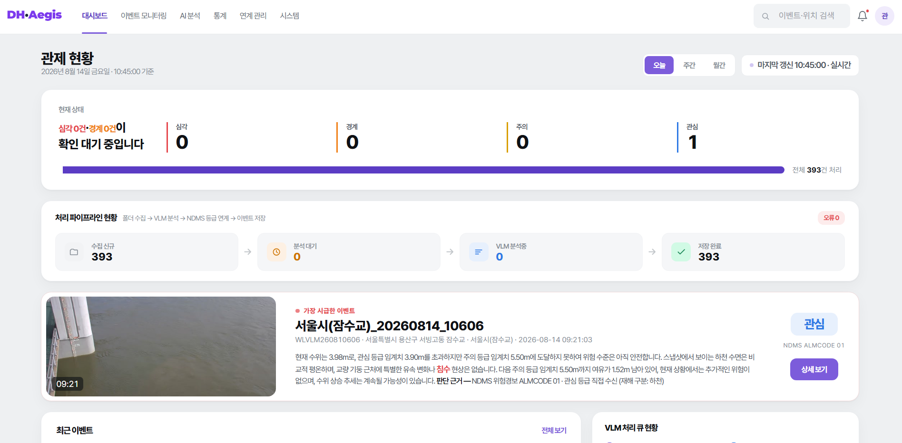

<b>스크린샷 더보기 (1장)</b>

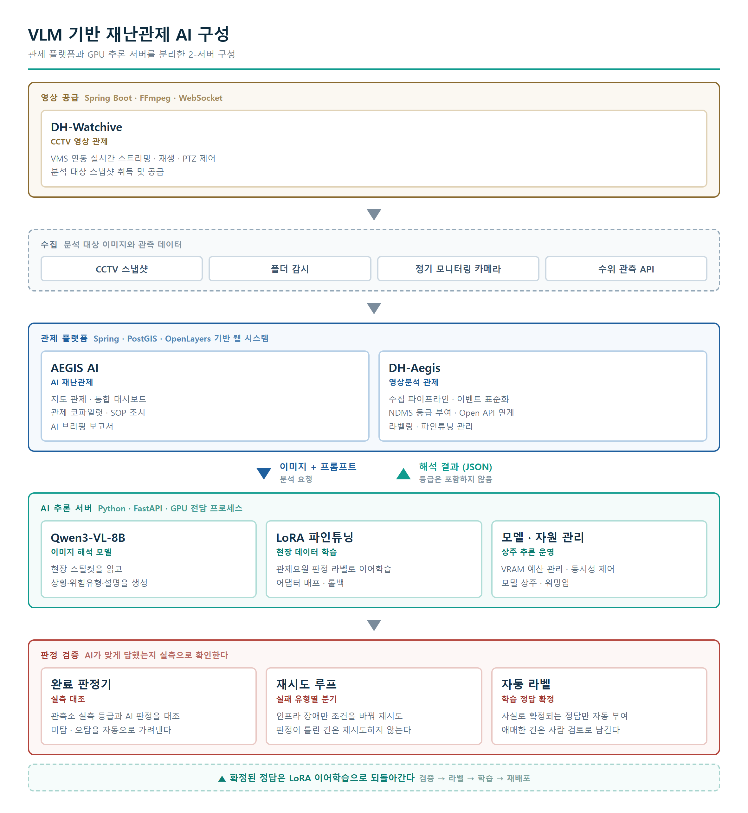

 

### CCTV 영상 관제 웹 시스템 (DH-Watchive)

- **개발 기간** : 2026.03 ~ 2026.04
- **사용 기술** : `Spring Boot` `JavaScript` `JSP` `PostgreSQL` `WebSocket` `FFmpeg` `MPEG-TS`
- **시스템 설명** : VMS(Video Management System)와 연동하여 CCTV 카메라의 실시간 스트리밍, 녹화 재생(Playback), PTZ 제어, 스냅샷 촬영, 녹화 스케줄 관리 등을 웹 브라우저에서 통합 수행할 수 있는 플랫폼입니다.
    - **브라우저 실시간 영상** — FFmpeg를 활용한 RTSP 스트림 릴레이와 WebSocket 기반 영상 스트리밍을 통해 브라우저에서 실시간 영상을 제공합니다.
    - **관제 기능** — 녹화 재생(Playback), PTZ 제어, 스냅샷 촬영, 녹화 스케줄 관리를 지원합니다.
    - **운영 편의** — 드래그앤드롭 위젯 기반 대시보드와 시스템 모니터링 기능을 포함합니다.
- **담당 역할** : 개발PM, 설계(기능정의, 화면설계, DB설계), 프론트엔드+백엔드 개발

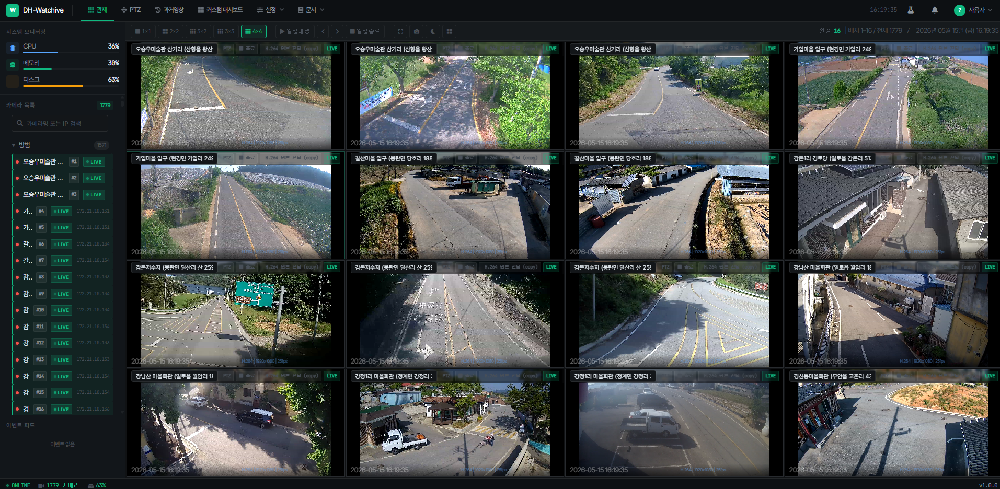

<b>스크린샷 더보기 (2장)</b>

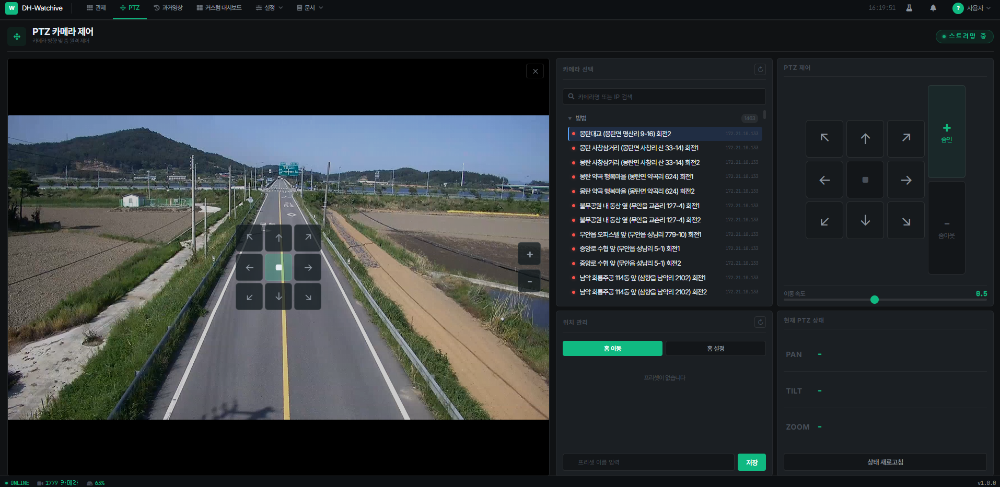

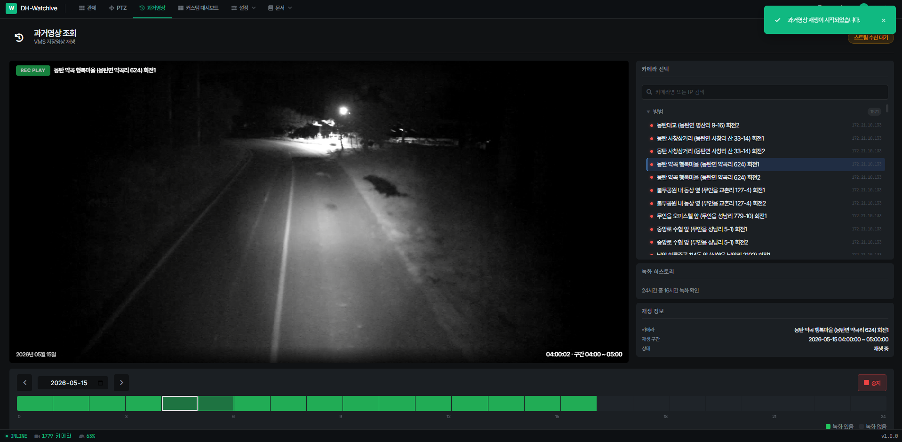

 

### 무안군 CCTV 통합관제 WebGIS 시스템 (DH-WebGIS)

- **개발 기간** : 2026.03 ~ 2026.04
- **사용 기술** : `Spring MVC` `JavaScript` `jQuery` `JSP` `PostgreSQL` `PostGIS` `OpenLayers` `GeoServer`
- **시스템 설명** : 무안군 CCTV 통합관제센터의 CCTV 위치 현황을 GIS 지도 위에 시각화하고, 실시간 영상 모니터링 및 장비 정보를 관리하는 시스템입니다.
    - **5대 서비스 연계** — 119(소방), 112(경찰), 전자발찌, 사회적 약자 등 5대 연계 서비스 데이터를 소켓/API로 통합 수신하여 관제합니다.
    - **투망 모니터링** — 사건 지점 주변 9개 CCTV를 동시에 표출합니다.
    - **관제 기능** — PTZ 제어, 과거 영상 조회, 영상 조회 이력 관리 기능을 제공합니다.
- **담당 역할** : 개발PM, 설계(기능정의, 화면설계, DB설계), 프론트엔드+백엔드 개발

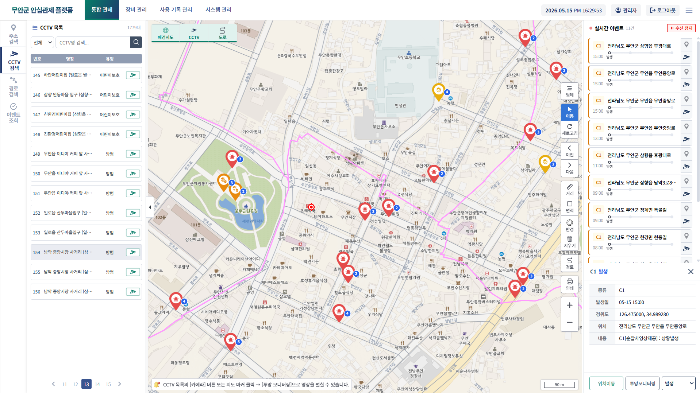

<b>스크린샷 더보기 (3장)</b>

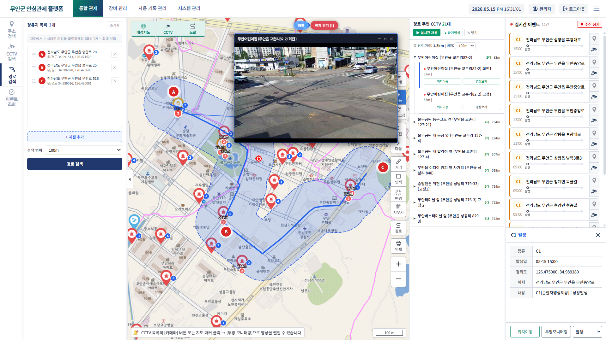

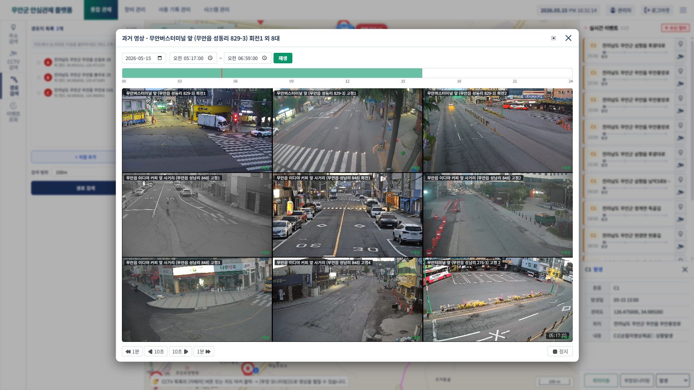

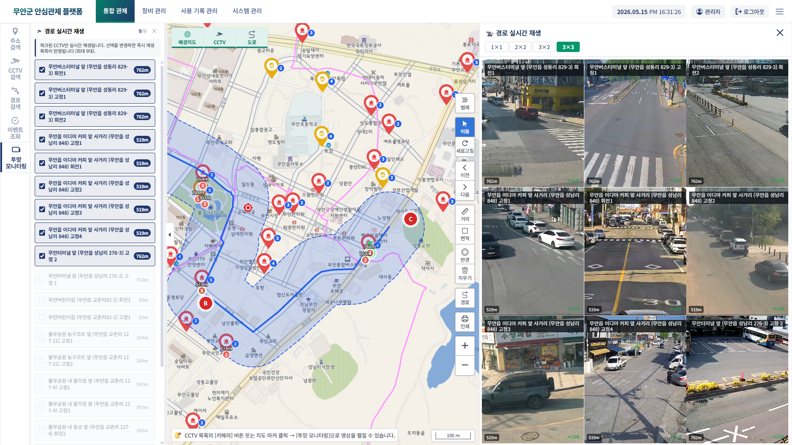

 

### 사내 IT 인프라 자산 관리 시스템 (DH-InfraVault)

- **개발 기간** : 2026.02 ~ 2026.03
- **사용 기술** : `Spring Boot` `JavaScript` `JSP` `PostgreSQL` `WebSocket`
- **시스템 설명** : 회사가 수행하는 GIS/스마트시티 사업(프로젝트)에 투입되는 서버, 업체(벤더), 유지보수 이력을 통합 관리하며, 사내 클라우드 드라이브(파일 저장소) 기능까지 포함한 웹 애플리케이션입니다.
    - **자산 통합 관리** — 사업별 서버, 업체(벤더), 유지보수 이력을 통합 관리합니다.
    - **현황 대시보드** — 사업 현황, 서버 수, 유지보수 건수를 한눈에 파악할 수 있습니다.
    - **사내 드라이브** — 문서 편집기, 파일 버전 관리, 공유 링크, Git 저장소 관리 기능을 제공합니다.
- **담당 역할** : 개발PM, 설계(기능정의, 화면설계, DB설계), 프론트엔드+백엔드 개발

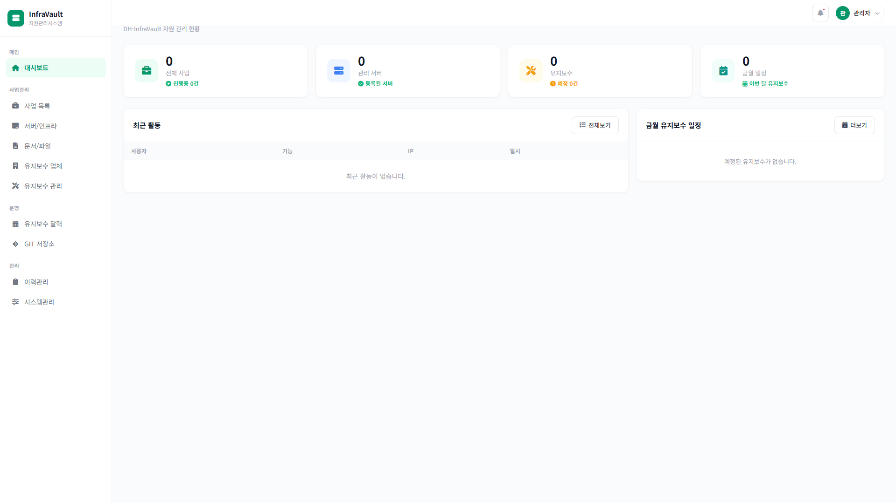

<b>스크린샷 더보기 (2장)</b>

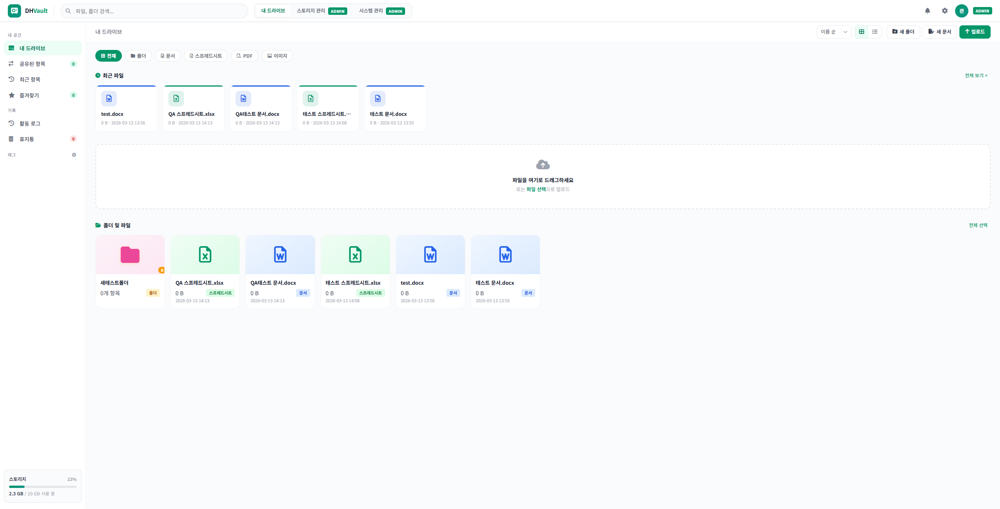

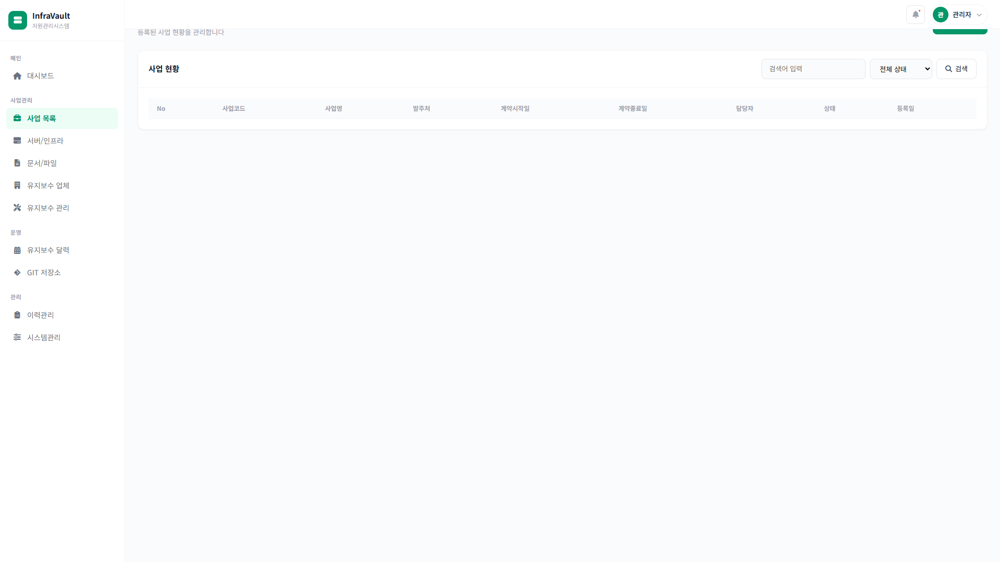

 

### CCTV 자동 진단 및 모니터링 플랫폼 (DH-Watchive-Check)

- **개발 기간** : 2026.01 ~ 2026.03
- **사용 기술** : `Spring MVC` `JavaScript` `JSP` `PostgreSQL` `PostGIS`
- **시스템 설명** : 지방자치단체에 설치된 CCTV 카메라의 상태를 자동으로 진단하고 장애를 탐지·분류·복구하는 NOC(Network Operations Center) 시스템입니다.
    - **다단계 자동 진단** — WebSocket 기반으로 네트워크 ping/TCP, 스트림 연결, 코덱 분석, 블랙프레임 감지를 순차적으로 수행합니다.
    - **일괄 진단 배치** — 6시간 주기 배치 스케줄러로 전체 카메라를 일괄 진단합니다.
    - **다중 사이트 관리** — 다수 사이트를 원격 에이전트 방식으로 통합 관리합니다.
    - **운영 리포트** — SSE 실시간 알림과 일간/주간 통계 리포트를 제공합니다.
- **담당 역할** : 개발PM, 설계(기능정의, 화면설계, DB설계), 프론트엔드+백엔드 개발

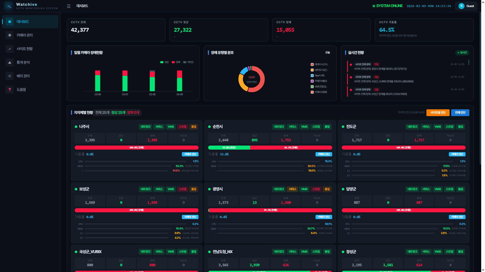

<b>스크린샷 더보기 (2장)</b>

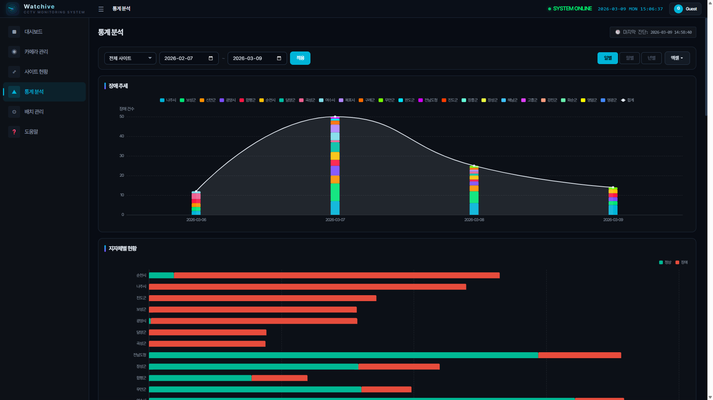

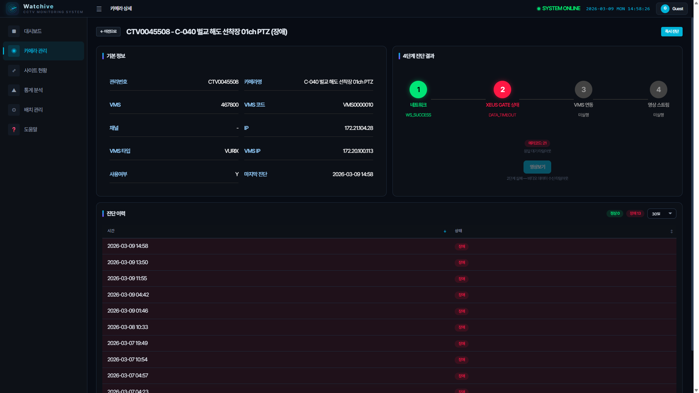

 

### AI 행정지원플랫폼 챗봇 (DH-AI)

- **개발 기간** : 2025.12 ~ 2026.02
- **사용 기술** : `Python` `FastAPI` `LangChain` `llama-cpp-python` `FAISS` `HuggingFace` `JavaScript` `jQuery` `Chart.js` `Jinja2`
- **시스템 설명** : 해남군 행정업무를 지원하기 위한 로컬 LLM 기반 한국어 질의응답 시스템입니다.
    - **온프레미스 LLM** — EEVE-Korean-10.8B 모델을 GGUF 포맷으로 로컬 GPU에서 구동하여, 개인정보 유출 없이 행정문서를 RAG(검색증강생성) 방식으로 검색하고 응답합니다.
    - **추론 구조** — ReAct 에이전트 기반 다단계 추론과 FAISS 벡터 유사도 검색을 적용했습니다.
    - **사용자 경험** — WebSocket 실시간 스트리밍 응답과 22종 이상의 행정 데이터 차트 시각화를 제공합니다.
    - **보안 · 운영** — JWT 인증과 MAC 기반 라이센스 관리를 구현했습니다.
    - **관리자 대시보드** — 채팅 로그 분석, RAG 성능 모니터링, 피드백 관리 기능을 제공합니다.
- **담당 역할** : 개발PM, 설계(기능정의, 화면설계, DB설계), LLM 서버 개발

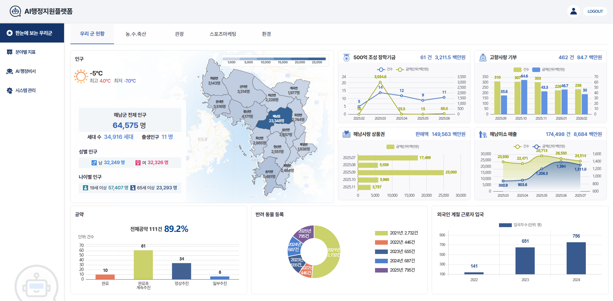

<b>스크린샷 더보기 (3장)</b>

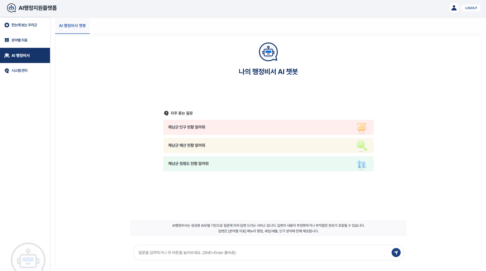

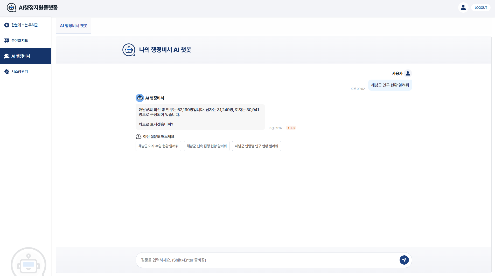

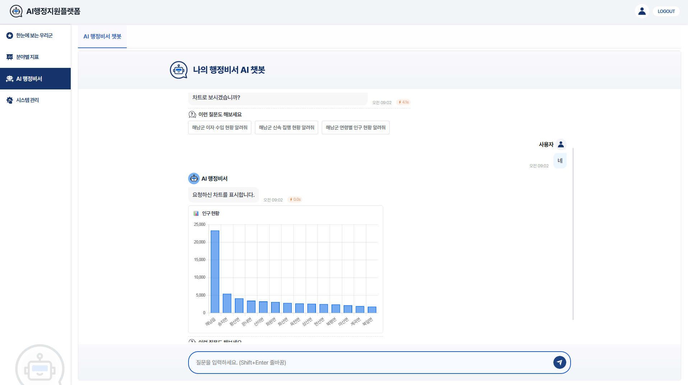

 

### 해남군 스마트 군정 시스템 V2 (HN-SmartOffice_V2)

- **개발 기간** : 2025.06 ~ 2025.11
- **사용 기술** : `Spring MVC` `Spring Security` `MyBatis` `JavaScript` `jQuery` `D3.js` `JSP` `PostgreSQL` `PostGIS` `OpenLayers` `GeoServer`
- **시스템 설명** : 전라남도 해남군을 위한 통합 데이터 관리 및 GIS 기반 빅데이터 플랫폼입니다.
    - **분야별 데이터 통합** — 군정 운영에 필요한 인구, 재정, 관광, 농업, 복지, 교육, 환경, 재난 등 다양한 분야의 데이터를 통합 관리합니다.
    - **시각화 분석** — 지도 기반 시각화 및 D3.js 차트 분석 기능을 제공합니다.
    - **공공데이터 연동** — 기상청, 대기오염, ITS 등 공공데이터 API와 연동하여 실시간 데이터를 수집하고, 분야별 현황을 대시보드로 제공합니다.
- **담당 역할** : 사업관리, 개발PM, 설계(기능정의, 화면설계, DB설계), 프론트엔드+백엔드 개발

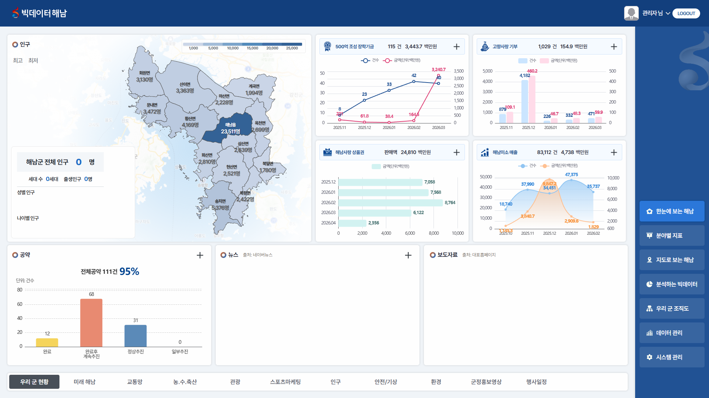

<b>스크린샷 더보기 (2장)</b>

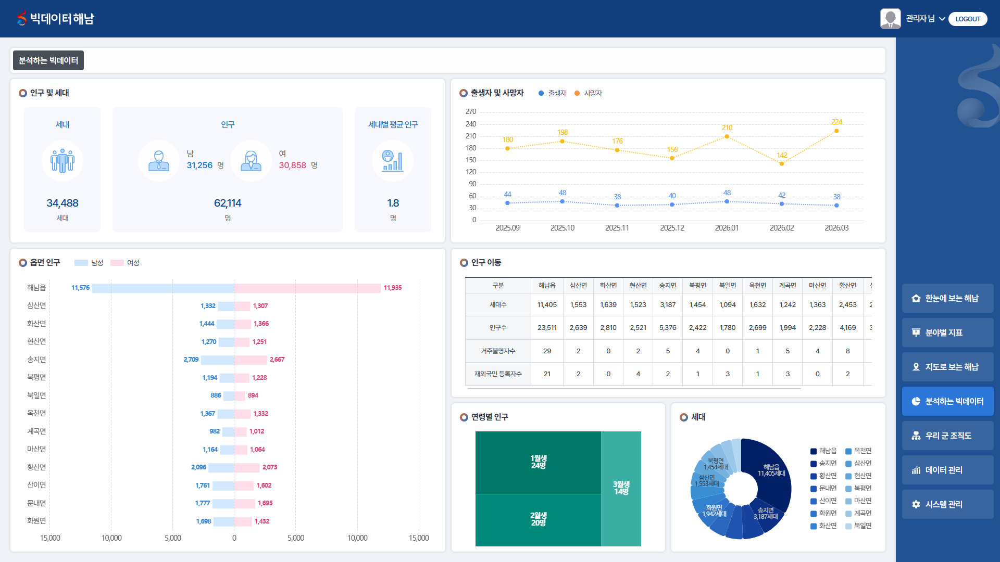

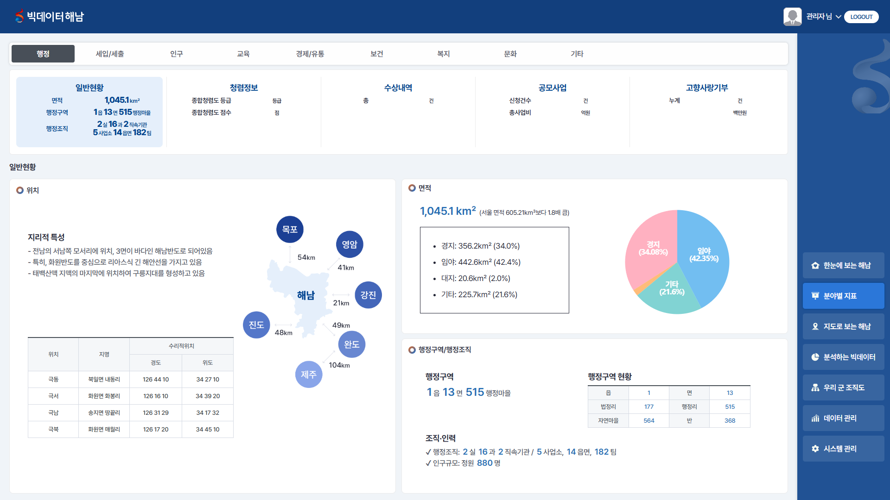

 

### 남원시 스마트시티 통합플랫폼 웹시스템 구축

- **개발 기간** : 2024.05 ~ 2024.12
- **사용 기술** : `전자정부프레임워크` `JavaScript` `HTML` `CSS` `jQuery` `PostgreSQL` `PostGIS` `OpenLayers` `GeoServer` `PowerMockup`
- **시스템 설명** : 남원시가 구축하고 있는 CCTV 영상을 유관기관에 제공하고, 남원시가 요청한 부가 S서비스를 함께 관리하는 시스템입니다.
    - **기관 영상 연계** — 경찰, 소방, 법무부(전자발찌) 등 해당 기관에서 영상을 요청할 경우 남원시 영상을 해당 기관으로 제공합니다.
    - **S서비스 구현** — 실시간 횡단보도 연기 정보, 차량번호인식카메라 데이터 수집, SMS 문자발송, LoRa 장비 연계 기능을 구현했습니다.
- **담당 역할** : 개발PM, 설계(기능정의, 화면설계, DB설계), 웹 개발(전체)

<b>스크린샷 더보기 (1장)</b>

 

### 디지털 트윈 웹 시스템 구축(3D지도 기반) v2.0

- **개발 기간** : 2024.01 ~ 2024.04
- **사용 기술** : `Spring MVC` `JavaScript` `HTML` `CSS` `jQuery` `PostgreSQL` `PostGIS` `Cesium.js` `GeoServer` `PowerMockup`
- **시스템 설명** : 개인 토이 프로젝트로, 3D 지도 위에서 실제 장비의 실시간 위치와 영상을 확인할 수 있는 시스템입니다.
    - **3D 표출** — 3D 지도 표출과 LOD 모델 표출을 구현했습니다.
    - **시뮬레이션 · 효과** — 트랜스포터 시뮬레이션, 기상효과, 정사영상(드론영상)을 제공합니다.
    - **실시간 연계** — 실시간 데이터를 받을 수 있는 REST API 서버를 구현하여, 실제 장비의 실시간 위치 및 영상을 확인할 수 있습니다.
- **담당 역할** : 개발PM, 설계(기능정의, 화면설계, DB설계), 웹 개발(전체)

<b>스크린샷 더보기 (1장)</b>

 

### 스마트 군정시스템 구축(빅데이터)

- **개발 기간** : 2023.05 ~ 2023.12
- **사용 기술** : `Spring MVC` `Spring Boot` `JavaScript` `HTML` `CSS` `jQuery` `PostgreSQL` `PostGIS` `Hadoop` `Zookeeper` `HBase` `Python` `OpenLayers` `OL-Cesium` `GeoServer` `PowerMockup`
- **시스템 설명** : 군에서 운영하고 있는 모든 데이터를 취합하여 군수가 전 분야 현황을 한눈에 파악할 수 있고, 뉴스 기사를 통해 정책을 객관적으로 평가할 수 있는 시스템입니다.
    - **군정 현황 통합** — 인구, 민원, 정책 평가, 재난 등의 현황 정보를 한 화면에서 쉽게 확인할 수 있습니다.
    - **정책 평가** — 키워드를 이용하여 뉴스 기사를 수집하고, 군에서 진행하는 정책에 대한 객관적인 평가를 확인할 수 있습니다.
- **담당 역할** : 개발PM, 설계(기능정의, 화면설계, DB설계), 데이터 수집 프로그램인 데이터 허브 웹 개발(공공데이터포털, ITS, 기상청, 생활안전지도 등), Hadoop EcoSystem 구축, 빅데이터 수집 프로그램 개발(키워드 관련 뉴스기사 전체 데이터 수집), 스마트 군정시스템 웹 개발(전체)

<b>스크린샷 더보기 (1장)</b>

 

### 데이터 허브

- **개발 기간** : 2023.05 ~ 2023.12
- **사용 기술** : `Spring Boot` `JavaScript` `HTML` `CSS` `jQuery` `PostgreSQL` `PowerMockup`
- **시스템 설명** : API 데이터를 자동으로 수집하고, 키 발급을 통해 필요한 사용자에게 API 데이터를 제공하는 프로그램입니다.
    - **자동 수집** — 공공데이터포털, ITS, SGIS, 바다누리 등의 API 데이터를 자동으로 수집합니다.
    - **데이터 제공** — 데이터를 원하는 사용자가 있을 경우 키 발급을 통하여 API 데이터를 제공합니다.
- **담당 역할** : 개발PM, 설계(기능정의, 화면설계, DB설계), 웹 시스템 개발(전체)

<b>스크린샷 더보기 (1장)</b>

 

### 디지털 트윈 웹 시스템 구축(3D지도 기반)

- **개발 기간** : 2022.01 ~ 2023.09
- **사용 기술** : `Spring MVC` `JavaScript` `HTML` `CSS` `jQuery` `PostgreSQL` `PostGIS` `Cesium.js` `OpenLayers` `OL-Cesium` `GeoServer` `PowerMockup`
- **시스템 설명** : 개인 토이 프로젝트로, 3D 지도 위에서 재난 상황을 시뮬레이션하고 센서를 연계하여 관제하는 시스템입니다.
    - **3D 표출** — 3D 지도 표출과 LOD 모델 표출을 구현했습니다.
    - **재난 시뮬레이션** — 화재 발생 및 홍수 발생 시뮬레이션을 제공합니다.
    - **센서 관제** — 센서를 연계하여 실시간으로 관제합니다.
- **담당 역할** : 개발PM, 설계(기능정의, 화면설계, DB설계), 웹 개발(전체)

<b>스크린샷 더보기 (1장)</b>

---

## 이전 프로젝트 (2015 ~ 2022)

지자체 공간정보·재난관제·스마트시티 구축 사업으로, 모든 프로젝트에서 **개발PM · 설계(기능정의/화면설계/DB설계) · 웹 개발 전체**를 담당했습니다.

| 개발 기간 | 프로젝트 · 시스템 설명 | 발주 | 사용 기술 |
|---|---|---|---|
| 2021.09 ~ 2022.01 | **IoT 통합플랫폼 웹 시스템 구축** 3D 지도를 표출하고, MQTT·Socket으로 수집한 센서 데이터를 저장하여 필요한 시스템에 REST API로 전달합니다. | 개인 프로젝트 | Spring MVC, Three.js, OpenLayers, OL-Cesium, PostGIS |
| 2021.06 ~ 2021.09 | **정읍시 스마트시티 통합플랫폼 웹시스템 구축** 유관기관에 CCTV 영상을 제공하고, 시설물·근무관리 등 필요한 시스템을 통합하여 관리합니다. | 정읍시 | 전자정부프레임워크, PostGIS, OpenLayers, GeoServer |
| 2020.11 ~ 2021.01 | **스마트시티 통합플랫폼 웹 시스템 구축** 전라남도 전역과 영암군의 CCTV 영상을 유관기관에 제공하고, 필요한 업무 시스템을 통합하여 관리합니다. | 전남도청, 영암군 | 전자정부프레임워크, PostGIS, OpenLayers, GeoServer |
| 2019.12 ~ 2020.03 | **전라남도 재난상황플랫폼 관제시스템 구축** 재난 예경보 시스템과 연계하여 각종 정보와 기상정보를 표출하고, 홍수·지진 등 재난에 대비합니다. | 전남도청 | Spring MVC, PostGIS, OpenLayers, GeoServer |
| 2019.04 ~ 2020.04 | **영암군·곡성군 공유재산 관리시스템 구축** 각 군이 보유한 토지(개인소유·국가·군·도)를 관리하고, 대여 시 관리합니다. | 영암군, 곡성군 | Spring MVC, PostGIS, OpenLayers, GeoServer |
| 2018.06 ~ 2018.12 | **영암군 통합 공간정보 클라우드 웹 시스템 구축** 보유 공간정보를 조회하고 토지대장·건축물대장을 제공하여 담당자가 업무에 활용할 수 있습니다. | 영암군 | Spring MVC, PostGIS, OpenLayers, GeoServer |
| 2018.05 ~ 2018.12 | **곡성군 재난상황통합관제시스템 웹시스템 구축** 재난 예경보 시스템과 연계하여 각종 정보와 기상정보를 표출하고, 홍수·지진 등 재난에 대비합니다. | 곡성군 | Spring MVC, PostGIS, OpenLayers, GeoServer |
| 2017.03 ~ 2020.01 | **해남군 하천통합관리시스템 웹 시스템 구축** 하천 측량 정보를 2D 지도에 표출하여 하천 관련 정보와 유지보수 정보를 관리합니다. | 해남군 | JSP, PostGIS, OpenLayers, GeoServer |
| 2016.05 ~ 2016.11 | **영광군 농업기반시설물 공간정보시스템 웹 시스템 구축** 농업 관련 정보를 2D 지도에 표출하여 관련 정보와 유지보수 정보를 관리합니다. | 영광군 | JSP, PostGIS, OpenLayers, GeoServer |
| 2015.08 ~ 2016.01 | **완도군 공간정보시스템 웹 서비스 개발** 보유 공간정보를 조회하고 토지대장·건축물대장을 제공하여 담당자가 업무에 활용할 수 있습니다. | 완도군 | JSP, PostGIS, OpenLayers, GeoServer |

---

## 대외 활동 · 자격증

**대외 활동**

- 네이버 클라우드 Hands-On (2023)
- LX 공간정보 아카데미 오픈소스 GIS 서비스 개발 입문 및 심화 (2018)
- 공개SW개발자 대회 최종 진출 (2014)

**자격증**

- 정보처리기사 / 한국산업인력공단 (2015.05)

---

## 소개

운동선수에서 개발자로 전향한 후, 11년간 백엔드 개발과 스타트업에서 다양한 프로젝트를 수행하며 폭넓은 경험을 쌓았습니다.
Java, Spring, PostgreSQL, Git, Linux, Hadoop, Zookeeper, HBase, OpenLayers, OL-Cesium, Cesium, GeoServer, FFmpeg, MPEG-TS 등을 활용하여 시스템의 설계, 개발, 운영을 직접 담당한 경험이 있습니다.
문제 해결을 위해 적극적으로 소통하며, 새로운 기술 도입에도 주저하지 않는 도전적인 개발자입니다.

| 항목 | 내용 |
|---|---|
| 이름 | 신인철 |
| 군필여부 | 군필 / 육군 병장 만기 전역 |
| 취미 | 캠핑, 달리기, 여행 |
| Email | incheols2929@gmail.com |
| GitHub | https://github.com/incheols2929 |
